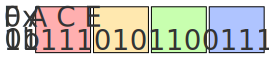

# Binary Number System
A binary number system works just like the familiar base-10 number system (where we use the symbols 0 thru 9) except the only allowable symbols are 0 and 1. The numbers are written positionally—where each position of a digit within the number has meaning—with the most significant digit being written on the left-most side.

For instance, in a base-10 number system, a four digit number \\( 2023 \\) has the value: 
\\[ 2 \times 10^3 + 0 \times 10^2 + 2 \times 10^1 + 3 \times 10^0 \\]

Notice that with four digits, we can represent at most \\(10^4 = 10000\\) unique numbers where the smallest non-negative representable number is \\(0 \\) and the largest representable number is \\(10^4 -1 = 9999 \\).

In a base-2 number system, a four digit number, a four digit number \\( 1011 \\) has the value:
\\[1 \times 2^3 + 0 \times 2^2 + 1 \times 2^1 + 1 \times 2^0 \\]

Notice that with four digits, we can represent at most \\(2^4 = 16_{10}\\) unique numbers where the smallest non-negative representable number is \\(0 \\) and the largest representable number is \\(2^4 -1 = 15_{10} \\).

Generalizing, a \\( n \\) digit binary number \\(d_{n-1} \ldots d_1 d_0 \\) has the value: 
\\[d_{n-1} \times 2^{n-1} + \cdots + d_1 \times 2^1 + d_0 \times 2^0 \\]
Furthermore, with \\( n \\) binary digits, we can represent \\(2^n -1 \\) unique digits where the smallest non-negative representable number is \\(0 \\) and the largest representable number is \\(2^n -1\\). 

## Base-16 Number System
Because, we can only use two symbols in the base-2 numbering system, our *bitstreams* are often long to write. Hence, we often use a shorthanded base-16 (also called **hexadecimal**) number system to condense the representation of bits. In this shorthand, we use 16 symbols \\( \\{1 \ldots 9, A, B, C, D, E, F \\} \\) where \\(A \\) through \\(F \\) represent 10 through 15.

Notably, we can convert each hex digit into exactly four bits (and vice versa). For example, we can do the following conversion in both directions:

