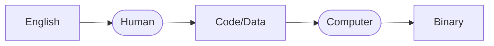

# Data Representation
There are more than 6000 different human languages in the world, each with its own standards and rules (namely grammar and vocabulary). As such, if we wanted to talk to another person, we would need to know the standards and rules of whatever language the other person speaks. For instance, to talk to a French person, you would need to know French or vice versa.

Computers, similarly, have their own standards and rules when it comes to communicating. For code, there are hundreds of programming languages that are available; for data, there are thousands of different formats that a computer could use (such as `*.txt`, `*.ppt`, and more).

However, regardless of what format we use to provide code and data, the computer stores it onto disk/memory by using a special representation called the **binary (base-2) numbering system**. By encoding and interpreting a set of **bits** (which is either a 1 or a zero), a computer can determine what that set of bits represent (data) or determine what to do (instructions).

---

[^num-lang] [https://www.linguisticsociety.org/content/how-many-languages-are-there-world](https://www.linguisticsociety.org/content/how-many-languages-are-there-world)