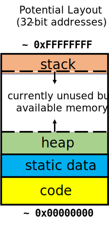

# Memory Management
There are two components that are core to any modern computer system: (1) CPU and (2) Memory. The central processing unit (CPU, or processor) is the hardware inside the computer that actually executes program instructions using data. Memory (RAM, or Random Access Memory) is the piece(es) of hardware that store the program that stores the program instructions and data. 

We can look at memory as a continuous series of bits that are logically blocked into chunks. These chunks are often byte-sized (8 bits) or word-sized depending on the hardware architecture. However, we will focus on the byte-sized (or **byte-addressable**) memory. In this scheme, individual bytes in memory can be accessed with a unique **address**. These addresses index the memory (the first byte would have address `0x00000000`, the next byte `0x00000001`, and so on) which makes it easy to read arbitrary parts of memory easily (hence the *random-access*).

In a byte-addressable scheme, the minimal unit of memory is a byte. Hence, if we wanted to read 4 bits from memory, we would have to get the address of the  corresponding byte (that contains those 4 bits), read the memory, and use masking and shifting to isolate the bits.

## The C Memory Model
In a C program, the two main parts of program is **code** (also called *text*) and **data**. Effective memory management is to figure out how to lay these two components onto memory.

Let's look at an example program:
```c
int my_static_var = 1;
int factorial(int n)
{
    if (n <= 1) return my_static_var;
    return n * factorial(n - 1);
}
void main(void)
{
    factorial(5);
}
```

The two lines that are inside the `factorial` function and the line that is inside the `main` function are the code.
```c
// from factorial(int n)
if (n <= 1) return my_static_var;
return n * factorial(n - 1);

// from main(void)
factorial(5);
```
The code has a few known properties:
1. The code is not likely to change during run-time. [^von-neumann-change]
2. The code must be loaded into RAM before a program can begin to execute.

The very first line of our program is called **static data**.
```c
int my_static_var = 1;
```
Static data is often overlooked, but very useful component of data. Static data (or static variables) lives outside of any function in our program, and can be accessed by any of them. Static data also has some properties which are:
1. Contrary to its name, it can change
2. The variable's size is fixed
3. Static data must be loaded into RAM before a program can begin to execute.

Lastly, the **stack** is a space for temporary dynamic data. The stack holds temporary variables and function arguments like:
```c
/*int factorial(*/ int n //)
/*factorial(*/ n - 1 //);
```
Space for these variables are allocated when a function is called and they are freed (or popped) when a function returns. As more functions are called, the stack grows downward (and lower addresses are allocated); as functions return, the stack reduces back upwards. [^recursion]

Heap

---
[^von-neumann-change] umm actually no.